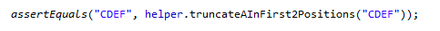
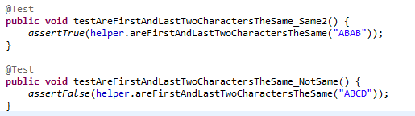
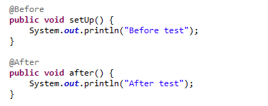
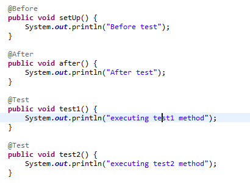
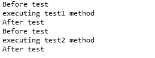
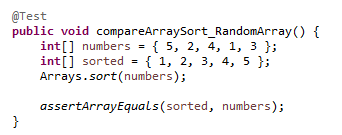
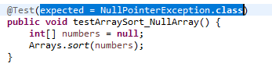
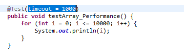
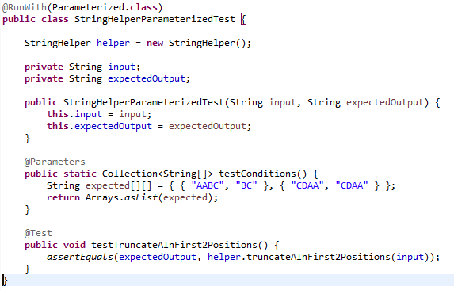
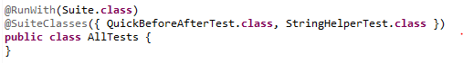

# JUnit4:

## Basic Information:
  •	@Test annotation should be placed on the top of the method to test the functions.  
  •	Any test method should be public and return type is void.  
  	
 
## Basic Methods:
 <ul>
	<li>`assertEquals(expected, actual);`  
		
	</li>	
	<li>
	`assertTrue(trueCondition);`  
	</li>
	<li>
	`assertFalse(falseCondition);`  
	
	</li>	
 </ul>	

## @Before and @After Annotation
<ul>
	<li>`@Before` annotation is used to setup some conditions that will be executed before the every test method.</li>
	<li>`@After` annotation is used to setup some conditions that will be executed after the every test method. 
	  
	</li>
	<li>Demonstrations: 
	   
	  Result:  
 	 
	</li>	
</ul>	
       
<b> Observation: </b> method with @Before annotations will be executed before the for every test method and after method will be after the test method.

## Other methods

•	`assertArrayEquals(expected, actual)`   
	To compare the array elements we will use assertArrayEquals method.    
 	
	
•	To handle the exception   
	
	
•	To do performance test   
 	
	
•	Parameterized test
	<ol>
		<li>Configure `@RunWith(Parameterized.class)` annotation</li>	
		<li>Define static method with `@Parameters` annotations</li>	
		<li>Create constructors with parameters</li>	
		<li>Pass the parameters as input for the functions.</li>	
	</ol>
 	

•	Organize into suites  
	<ol>
		<li>Create a class and configure  ` @RunWith(Suite.class)` </li>	
		<li>Use annotation `@SuiteClasses` and define the classes which need to be suites</li>	
	</ol>
	  For ex:   `@SuiteClasses({ QuickBeforeAfterTest.class, StringHelperTest.class })`  
		
		
	     
	 
